# Linux System Monitoring Report using AWS EC2

## Project Description
This project demonstrates Linux system monitoring on AWS EC2 using basic Linux commands. It monitors memory, disk, CPU, processes, and system uptime.

---
# Technologies Used

| Technology | Purpose |
|------------|---------|
| AWS EC2 | Cloud Virtual Server |
| Amazon Linux 2023 | Operating System |
| Linux Commands | System Monitoring |
| SSH | Remote Server Access |
| GitHub | Project Hosting |
| Git Bash / PowerShell | Server Connectivity |

---

# Project Architecture

<p align="center">
  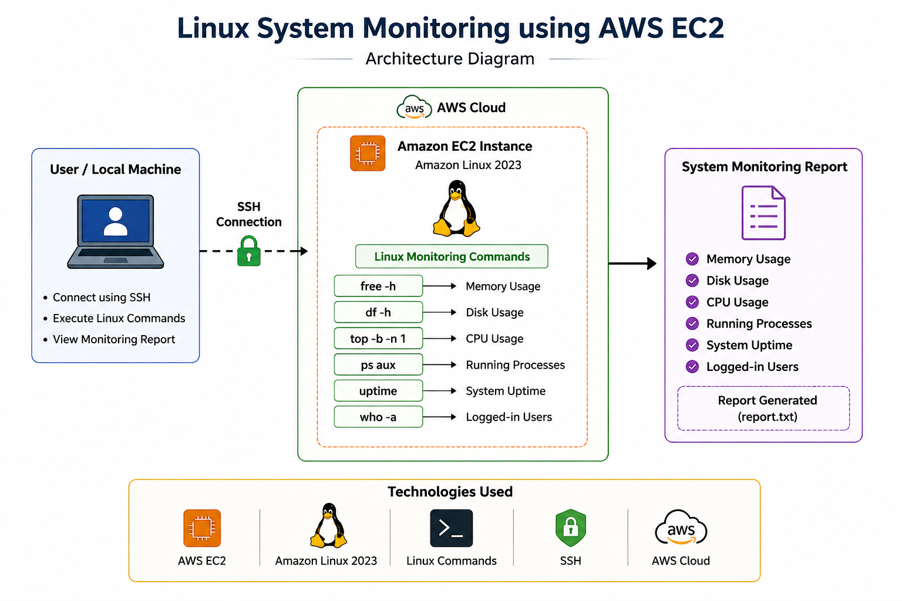
</p>

---

# Features

- Linux Server Monitoring
- Memory Usage Monitoring
- Disk Usage Monitoring
- CPU Usage Monitoring
- Running Process Monitoring
- System Uptime Monitoring
- Logged-in User Tracking
- Report Generation using Linux Commands
- AWS EC2 Practical Implementation

---
# Implementation Steps

## Step 1: Launch AWS EC2 Instance

- Created Amazon Linux 2023 EC2 instance
- Enabled SSH access in Security Group
- Downloaded PEM key file
- Connected instance using SSH

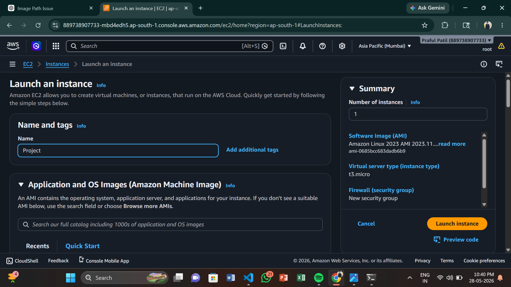

---

## Step 2: Connect EC2 Instance using SSH

```bash
ssh -i project.pem ec2-user@YOUR_PUBLIC_IP
```

Successfully connected to the Linux server from local system.

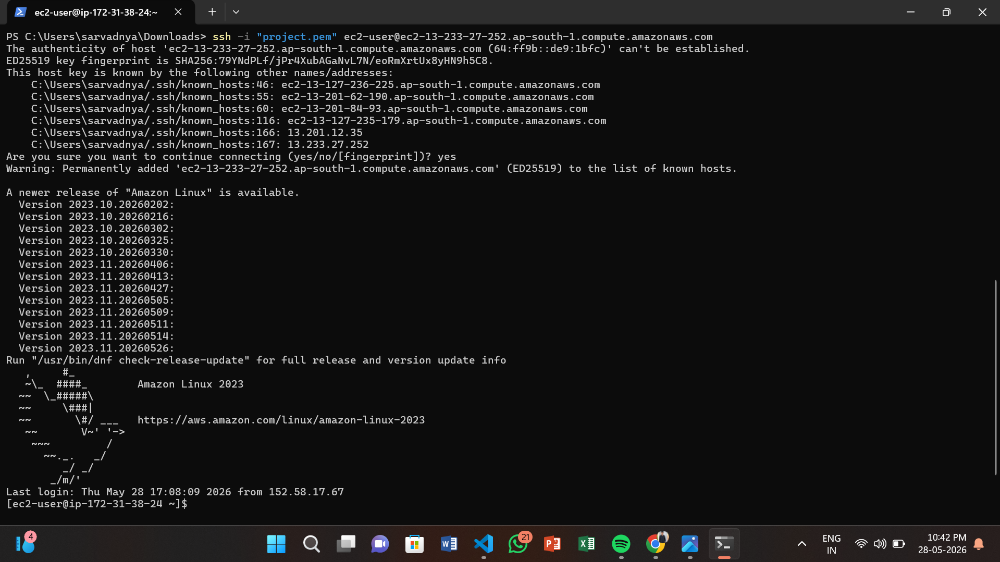

---

## Step 3: Create Project Directory

```bash
mkdir Linux-project
cd Linux-project
```

Created separate project folder for report files.

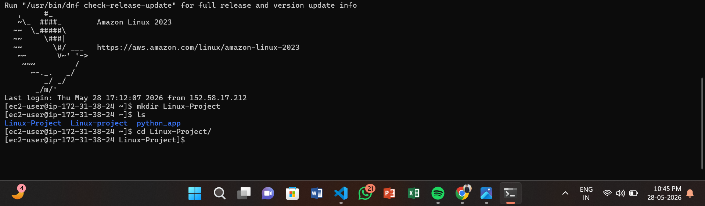

---

## Step 4: Create Report File

```bash
touch report.txt
```

Created report file to store monitoring output.

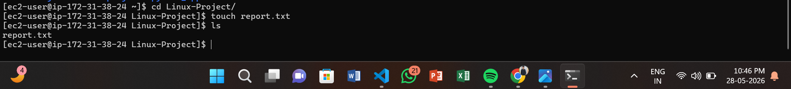

---

# Linux Monitoring Commands

## Memory Usage Monitoring

Command used:

```bash
free -h
```

This command displays RAM and swap memory usage in human-readable format.

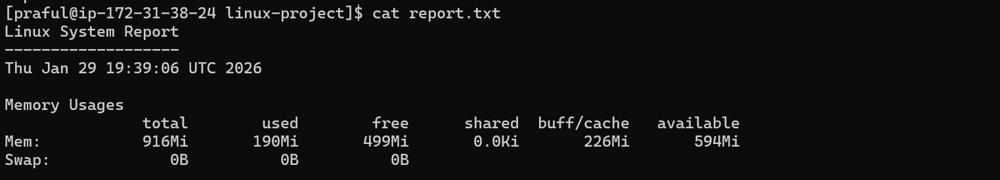

---

## Disk Usage Monitoring

Command used:

```bash
df -h
```

This command displays filesystem and disk partition usage.

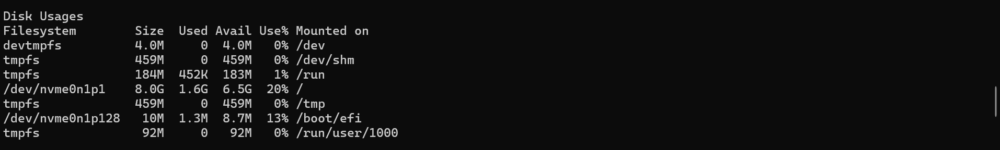

---

## CPU Usage Monitoring

Command used:

```bash
top -b -n 1
```

This command displays CPU usage, running tasks, and system load.

### Information Collected

- CPU Utilization
- Running Tasks
- Load Average
- Active Processes
- Memory Usage

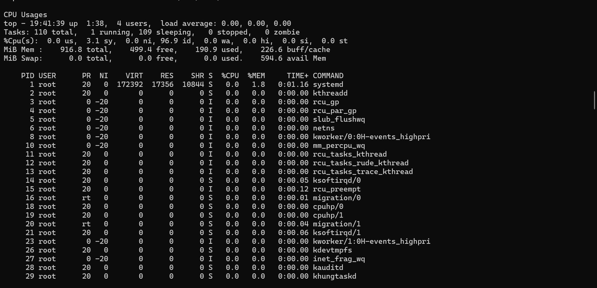

---

## Running Processes Monitoring

Command used:

```bash
ps aux
```

This command displays all running processes inside the Linux server.

### Information Included

- Process ID
- CPU Usage
- Memory Usage
- User
- Command Name

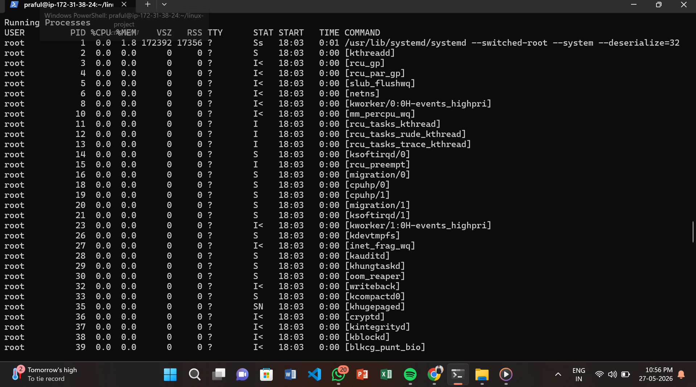

---

## System Uptime Monitoring

Command used:

```bash
uptime
```

This command displays server running time and load average.

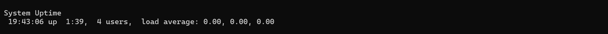

---

## Logged-in Users Monitoring

Command used:

```bash
who -a
```
This command displays currently logged-in users connected to the server.

### Information Included

- Username
- Login Time
- Terminal Session
- IP Address

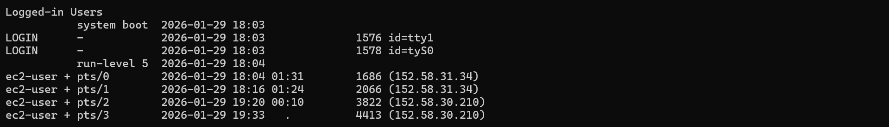

---
# Project Output

- Successfully connected AWS EC2 instance using SSH
- Created Linux System Monitoring Report
- Monitored memory, disk, CPU, and processes
- Generated report using Linux commands
- Practiced Linux administration and server monitoring

---

# Problems Faced During Project

During this project, I faced some practical issues such as:

- SSH connection issues
- Permission problems with PEM key
- Linux command syntax mistakes
- File permission confusion
- Understanding monitoring outputs

I solved these issues by checking logs, verifying permissions, and practicing Linux troubleshooting.

---

# Learning Outcomes

Through this project, I learned:

- AWS EC2 basics
- Linux server management
- SSH connectivity
- System monitoring commands
- Process management
- Linux file handling
- Basic troubleshooting
- GitHub project documentation

---


# Author

Praful Patil

---

# Conclusion

This project is a beginner-friendly Linux and AWS monitoring project developed using AWS EC2 and Amazon Linux 2023.

It provides practical experience in Linux server monitoring, AWS cloud usage, and basic DevOps operations.

